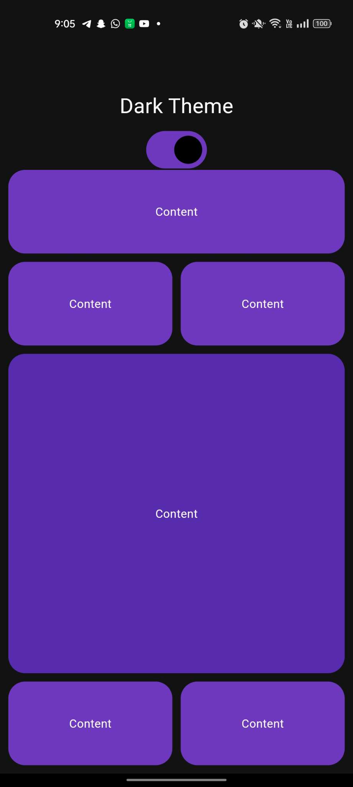
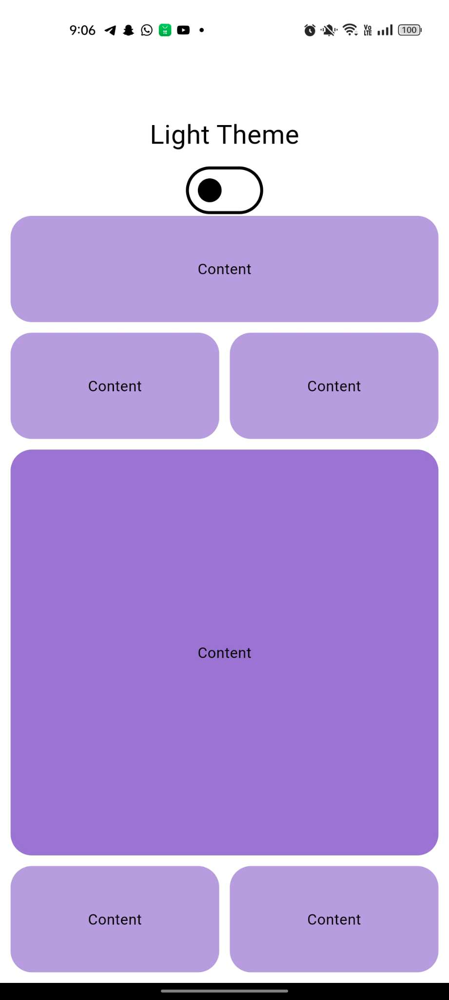

# Dark and Light Mode Switching

A Flutter project/application that has the ability to switch between dark and light themes

## Getting Started

we’ll use Provider as a state management solution and create a Switch in the ‘HomePage’ that will trigger the event.

## Results

